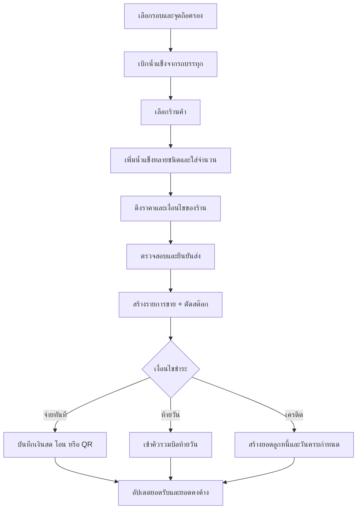

# Flow ใหม่: เบิกน้ำแข็ง ส่งร้าน และรับชำระ

เอกสารนี้กำหนด Flow เป้าหมายสำหรับงานของพนักงานส่ง ตั้งแต่รับน้ำแข็งจากรถบรรทุกหลัก ส่งให้ร้าน จนถึงบันทึกการชำระเงินหรือสร้างยอดลูกหนี้

สถานะ: **Flow เป้าหมาย ยังไม่ใช่พฤติกรรมของระบบปัจจุบัน**

## หลักการ

1. การย้ายน้ำแข็งจากรถบรรทุกไปยังรถเข็นหรือพนักงานเป็นการโอนสต๊อก ยังไม่ใช่ยอดขาย
2. การส่งให้ร้านต้องสร้างรายการขายและตัดสต๊อกจากจุดถือครองของพนักงานใน transaction เดียวกัน
3. การส่งสินค้าต้องสำเร็จโดยไม่ขึ้นกับว่าลูกค้าชำระเงินแล้วหรือไม่
4. ราคาต่อหน่วยและยอดเงินต้องถูก snapshot ไว้กับรายการส่ง การเปลี่ยนราคาภายหลังห้ามกระทบยอดเดิม
5. เงื่อนไขชำระ วิธีชำระ และสถานะชำระเป็นคนละข้อมูลกัน
6. การกดยืนยันซ้ำด้วย idempotency key เดิมต้องไม่สร้างรายการส่ง รายการรับเงิน หรือลูกหนี้ซ้ำ

## ข้อมูลการชำระที่ต้องแยกจากกัน

| ข้อมูล | ความหมาย | ค่าหลัก |
|---|---|---|
| เงื่อนไขชำระ (`payment_term`) | ร้านมีกำหนดจ่ายเมื่อใด | `immediate`, `end_of_day`, `credit` |
| วิธีชำระ (`payment_method`) | ช่องทางที่รับเงินจริง | `cash`, `bank_transfer`, `qr` |
| สถานะชำระ (`payment_status`) | ผลจากยอดเรียกเก็บลบด้วยยอดรับที่จัดสรรแล้ว | `unpaid`, `partial`, `paid` |

`payment_method` เป็นค่าว่างได้จนกว่าจะมีการรับเงินจริง ส่วน `payment_status` ต้องคำนวณจากยอดเงิน ไม่ให้ผู้ใช้เลือกสถานะโดยตรง

## ช่วงที่ 1: เบิกน้ำแข็งไปยังจุดถือครอง

1. พนักงานเลือกรอบส่งที่กำลังทำงาน
2. ระบบเลือกจุดถือครองที่ผูกกับพนักงานให้อัตโนมัติ เช่น รถเข็นคันที่ 1 หรือทีมตึก B
3. พนักงานใส่จำนวนที่รับจากรถบรรทุกแยกตามชนิดน้ำแข็ง
4. ระบบแสดงยอดก่อนเบิก ยอดที่กำลังเบิก และยอดหลังเบิกของทั้งต้นทางกับปลายทาง
5. เมื่อยืนยัน ระบบสร้าง stock transfer จากรถบรรทุกหลักไปยังจุดถือครองของพนักงานแบบ atomic
6. ระบบแสดงสต๊อกคงเหลือของจุดนั้นแยกตามชนิด

ตัวอย่าง:

| ชนิดน้ำแข็ง | จำนวนเบิก |
|---|---:|
| น้ำแข็งเล็ก | 30 กระสอบ |
| น้ำแข็งโม่ | 15 กระสอบ |
| น้ำแข็งก้อน | 5 กระสอบ |
| **รวม** | **50 กระสอบ** |

การรับเพิ่มระหว่างวันต้องสร้าง stock transfer ใหม่ ห้ามแก้จำนวนในรายการเบิกเดิม

## ช่วงที่ 2: ส่งให้แต่ละร้าน

1. ค้นหาหรือกรองตามอาคารและโซน แล้วเลือกร้านปลายทาง
2. ระบบแสดงน้ำแข็งทุกชนิดที่เปิดใช้งาน
3. พนักงานเพิ่มน้ำแข็งได้หลายชนิดในรายการเดียว
4. ใส่จำนวนแต่ละชนิดด้วยปุ่มขนาดใหญ่แบบ `− / จำนวน / +`
5. ระบบดึงราคาของร้านและคำนวณยอดต่อรายการกับยอดรวม
6. ระบบดึงเงื่อนไขชำระเริ่มต้นของร้านมาแสดง
7. ถ้าเป็นร้านเครดิต ระบบตรวจสิทธิ์ ยอดค้าง และวงเงินเครดิตก่อนให้ยืนยัน
8. พนักงานตรวจสอบร้าน รายการสินค้า จำนวน ราคา และยอดรวม
9. พนักงานกดยืนยันส่งสินค้า

ตัวอย่างรายการ:

| สินค้า | จำนวน | ราคา/หน่วย | รวม |
|---|---:|---:|---:|
| น้ำแข็งเล็ก | `− 5 +` | 25 บาท | 125 บาท |
| น้ำแข็งโม่ | `− 2 +` | 30 บาท | 60 บาท |
| น้ำแข็งก้อน | `− 0 +` | 40 บาท | — |
| **รวม** | **7 กระสอบ** |  | **185 บาท** |

บนโทรศัพท์ให้แสดงเป็นการ์ดหรือแถวขนาดใหญ่ ส่วนโครงสร้างข้อมูลภายในยังคงเป็นรายการหลายแถว

## จุดยืนยันการส่งสินค้า

เมื่อพนักงานกดยืนยัน ระบบต้องทำงานต่อไปนี้ใน transaction เดียว:

1. ตรวจว่ารอบส่งยังเปิดและพนักงานมีสิทธิ์บันทึก
2. ตรวจว่าสต๊อกของจุดถือครองมีเพียงพอแยกตามชนิด
3. สร้างรายการส่งและรายการย่อยของน้ำแข็งแต่ละชนิด
4. snapshot ราคาต่อหน่วย ยอดต่อรายการ ยอดรวม และเงื่อนไขชำระขณะนั้น
5. ตัดสต๊อกจากจุดถือครองของพนักงาน
6. สร้างหรือผูกรายการเรียกเก็บเริ่มต้นตามเงื่อนไขของร้าน โดยยังไม่ถือว่ามีการรับเงิน
7. อัปเดตประวัติร้านและ audit log

หากขั้นตอนใดไม่สำเร็จต้อง rollback ทั้งหมด ห้ามเกิดกรณีตัดสต๊อกแล้วแต่ไม่มีรายการส่ง หรือมีรายการส่งแต่สต๊อกไม่ลด

## ช่วงที่ 3: ดำเนินการตามเงื่อนไขชำระ

หลังยืนยันการส่งสินค้าสำเร็จ ระบบจึงแยกทางตามเงื่อนไขของร้าน

### จ่ายทันที

1. แสดงยอดที่ต้องชำระ
2. เลือกวิธีชำระ: เงินสด โอน หรือ QR
3. ใส่จำนวนเงินที่รับจริง
4. ระบบคำนวณเงินทอนหรือยอดคงค้าง
5. หากรับไม่ครบ ระบบต้องคงยอดค้างไว้และแจ้งหรือขออนุมัติตามนโยบายร้าน โดยห้ามยกเลิกรายการส่งที่เกิดขึ้นแล้วโดยอัตโนมัติ
6. เมื่อบันทึกรับเงิน ระบบอัปเดตสถานะเป็นจ่ายครบหรือจ่ายบางส่วน

### เก็บเงินท้ายวัน

1. เมื่อยืนยันส่ง ระบบบันทึกรายการเข้าคิวรวมบิลท้ายวันให้อัตโนมัติ โดยยังไม่ต้องเลือกวิธีชำระ
2. ระบบรวมรายการส่งสถานะใช้งานทุกครั้งของร้านในวันเดียวกัน
3. เมื่อปิดยอดร้าน ระบบสร้างใบสรุปยอดหรือใบแจ้งยอดเพียงหนึ่งฉบับต่อร้านต่อวันแบบ idempotent
4. พนักงานบันทึกยอดรับและวิธีชำระครั้งเดียว
5. หากรับไม่ครบ ส่วนที่เหลือจะเป็นยอดคงค้างโดยไม่แก้ยอดขายเดิม

ตัวอย่างสรุปท้ายวัน:

| รอบส่ง | จำนวนเงิน |
|---|---:|
| 08:30 | 185 บาท |
| 12:15 | 240 บาท |
| 16:40 | 120 บาท |
| **ยอดท้ายวัน** | **545 บาท** |

### เครดิต

1. เมื่อยืนยันส่งสินค้า ระบบสร้างยอดลูกหนี้จากรายการส่งโดยอัตโนมัติ
2. คำนวณวันครบกำหนดจากวันที่ส่งและจำนวนวันเครดิตของร้าน
3. เก็บเลขที่บิล วันที่ส่ง วันครบกำหนด ยอดตั้งต้น และยอดคงค้าง
4. การยืนยันส่งต้องผ่านการตรวจวงเงินเครดิตหรือมีการอนุมัติก่อนแล้ว
5. แสดงวงเงินเครดิตคงเหลือหลังบันทึก
6. หากไม่ผ่านวงเงินและไม่มีการอนุมัติ ระบบต้องปฏิเสธก่อนสร้างรายการส่งและตัดสต๊อก

## การคืนและปิดสต๊อกของพนักงาน

1. เมื่อส่งงานเสร็จ ระบบแสดงยอดคงเหลือตามระบบแยกตามชนิด
2. หัวหน้าหรือพนักงานที่มีสิทธิ์กรอกจำนวนที่นับได้จริง
3. ระบบเทียบยอดตามระบบกับยอดนับจริง และเก็บส่วนต่างพร้อมหมายเหตุ
4. น้ำแข็งที่เหลือต้องบันทึกเป็นรายการโอนคืนรถบรรทุก เก็บเข้าถังสำรอง หรือส่งคืนโรงงานตามเหตุการณ์จริง
5. ห้ามแก้ทับรายการเบิกหรือรายการส่งเดิม

## ค่าที่ Admin ต้องตั้งรายร้าน

- ราคาของน้ำแข็งแต่ละชนิดและวันที่เริ่มมีผล
- เงื่อนไขเริ่มต้น: จ่ายทันที เก็บเงินท้ายวัน หรือเครดิต
- จำนวนวันเครดิตและรอบวางบิล
- วงเงินเครดิต ถ้าไม่จำกัดให้เก็บเป็นค่าว่าง
- อนุญาตให้ค้างชำระหรือไม่
- วิธีชำระเริ่มต้น ถ้าร้านมีวิธีที่ใช้แน่นอน
- บทบาทที่มีสิทธิ์เปลี่ยนราคา เงื่อนไขชำระ วงเงินเครดิต และการอนุมัติยอดค้าง

พนักงานใช้ค่าที่ตั้งไว้โดยอัตโนมัติ ห้ามเปลี่ยนราคาหรือเงื่อนไขหน้างานถ้าไม่มีสิทธิ์

## Flow รวม

## โครงสร้างข้อมูลที่ต้องรองรับ

- จุดถือครองสต๊อกที่ผูกกับพนักงานหรือรถเข็น
- รายการโอนสต๊อกจากรถบรรทุกไปยังจุดถือครอง
- ราคาน้ำแข็งแต่ละชนิดแยกรายร้านและช่วงวันที่มีผล
- เงื่อนไขชำระ จำนวนวันเครดิต รอบวางบิล วงเงินเครดิต และสิทธิ์การค้างชำระของร้าน
- รายการส่งที่ snapshot จุดต้นทาง ราคา ยอดเงิน และเงื่อนไขชำระ
- ใบสรุปยอด ใบแจ้งยอด ใบเสร็จ และรายการต้นทางที่นำมารวม
- รายการรับชำระและการจัดสรรเงินไปยังเอกสาร
- audit log สำหรับการแก้ไข ยกเลิก เปลี่ยนเงื่อนไข และอนุมัติยอดค้าง

## กฎตรวจสอบสำคัญ

- การส่งแต่ละครั้งต้องมีน้ำแข็งอย่างน้อยหนึ่งชนิดและจำนวนมากกว่าศูนย์
- ห้ามส่งเกินสต๊อกคงเหลือของจุดถือครองแยกตามชนิด
- ราคาที่ใช้ต้องเป็นราคาที่มีผลขณะยืนยันส่ง
- น้ำแข็งทุกชนิดที่มีจำนวนมากกว่าศูนย์ต้องมีราคาที่ใช้งานอยู่ หากไม่มีให้ปฏิเสธการยืนยันและแจ้ง Admin
- ห้ามเปลี่ยนราคาย้อนหลังด้วยการแก้ master data
- การรับเงินต้องระบุยอดที่รับ วิธีชำระ ผู้รับ และเวลา
- รับเงินบางส่วนแล้วต้องคงยอดเหลือไว้
- ร้านที่ไม่ได้รับอนุญาตห้ามสร้างยอดค้างหรือเครดิตโดยไม่มีผู้อนุมัติ
- การส่งซ้ำด้วย idempotency key เดิมต้องได้ผลลัพธ์เดิม
- รายการที่ออกเลขเอกสารแล้วห้ามลบหรือแก้ยอดโดยตรง

## เกณฑ์รับงาน

- พนักงานเบิกน้ำแข็งหลายชนิดไปยังจุดถือครองของตนเองได้ และยอดรถบรรทุกกับยอดปลายทางเปลี่ยนถูกต้อง
- ส่งหลายร้านแล้วยอดคงเหลือของจุดถือครองลดลงตรงตามชนิดและไม่ติดลบ
- ร้านเดียวรับน้ำแข็งได้หลายครั้งและหลายชนิดในวันเดียว
- ยอดขายเดิมไม่เปลี่ยนเมื่อ Admin แก้ราคาใหม่
- ร้านจ่ายทันทีรองรับเงินสด โอน QR การจ่ายบางส่วน และยอดทอน
- ร้านท้ายวันรวมรายการส่งทุกครั้งได้ยอดเดียวและปิดยอดได้ครั้งเดียว
- ร้านเครดิตสร้างลูกหนี้และวันครบกำหนดถูกต้อง พร้อมคำนวณวงเงินคงเหลือ
- ปิดสต๊อกของพนักงานแล้วเก็บยอดตามระบบ ยอดนับจริง ส่วนต่าง และปลายทางของน้ำแข็งที่เหลือครบถ้วน
