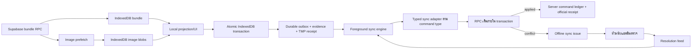

# แผนรองรับ Offline เต็มรูปแบบสำหรับพนักงาน

สถานะ: เริ่มดำเนินการแล้ว — Development Step 1 เสร็จเมื่อ 2026-08-11
ขอบเขต: งานพนักงานทั้งหมดบนเครื่องประจำตัว  
กลุ่มอุปกรณ์: Android รุ่นเก่าและไม่ทราบรุ่นขั้นต่ำ

## 1. เป้าหมายและข้อตกลง

ระบบต้องให้พนักงานเปิดแอป ดูข้อมูลงาน และทำรายการต่อไปนี้ได้หลังจากเคยเข้าสู่ระบบและเตรียมข้อมูลของวันนั้นสำเร็จแล้ว แม้อินเทอร์เน็ตขาดหรือไม่เสถียร:

- เบิกน้ำแข็งเข้าจุดถือครอง
- คืนน้ำแข็ง
- บันทึกน้ำแข็งละลายหรือเสียหาย
- เลือกร้านและบันทึกการส่งหรือเหตุส่งไม่ได้
- ขายสดและรับเงิน
- รับชำระจากคิวเก็บเงิน
- แนบหลักฐานการชำระ
- ดูรูปหน้าร้านและรูปสินค้า
- ออกใบรับรายการชั่วคราวและพิมพ์ใบเสร็จจริงหลังซิงก์

ข้อตกลงที่ยืนยันแล้ว:

- โทรศัพท์หนึ่งเครื่องเป็นเครื่องประจำตัวของพนักงานหนึ่งคน
- ข้อมูล offline ใช้ได้ถึงสิ้นวันงานตามเวลา `Asia/Bangkok`
- ระบบเตรียมข้อมูล offline โดยอัตโนมัติ ไม่มีขั้นตอนที่พนักงานต้องกดเริ่ม
- หลัง business data พร้อม การเลือกร้านต้องแสดงราคา สต๊อก และเงื่อนไขชำระจากเครื่องทันที ไม่รอ network ซ้ำทุกครั้ง
- การบันทึกรายการต้องถือว่าสำเร็จเมื่อเขียนลงเครื่องแบบ durable แล้ว ส่วนการส่ง server ทำต่อในคิวและไม่ค้างปุ่มบันทึก
- รูปหลักฐานถูกบีบอัดไม่เกิน 1 MB ส่วน PDF ใช้เพดานเดิม 5 MB
- เมื่อเซิร์ฟเวอร์ปฏิเสธรายการ ระบบพักคิวไว้ให้ตรวจ ห้ามปรับจำนวน ราคา หรือเงินอัตโนมัติ
- การยกเลิกรายการ conflict ทำได้เฉพาะหัวหน้ารอบ (`round_lead`) หรือแอดมิน พร้อมเหตุผลและประวัติตรวจสอบ
- การรับเงิน offline ออกเพียงใบรับรายการชั่วคราว เลขใบเสร็จจริงต้องมาจากเซิร์ฟเวอร์หลังซิงก์

## 2. ผลตรวจระบบปัจจุบัน

### 2.1 สิ่งที่มีอยู่แล้ว

- PWA มี manifest, service worker, navigation fallback และ app-shell precache
- RPC สำคัญของการส่ง สต๊อก และรับเงินส่วนใหญ่รองรับ `idempotency_key`
- มี `client_recorded_at` แยกจากเวลาที่เซิร์ฟเวอร์รับข้อมูล
- มี local recovery สำหรับ draft และ pending request identity บางส่วนใน `localStorage`
- มีข้อความสถานะ Online/Offline และป้องกันอัปเดต Service Worker ระหว่างมี draft
- Production build และ test suite ปัจจุบันผ่าน โดย UI tests ผ่าน 39 รายการ

### 2.2 ช่องว่างที่ต้องแก้

- Service worker cache เฉพาะ app shell และ Google Fonts ไม่ได้ cache ข้อมูล Supabase หรือรูปร้าน
- การโหลดโปรไฟล์ รอบ ร้าน สต๊อก ราคา และคิวเก็บเงินต้องออนไลน์ทุกครั้ง
- Signed URL ของรูปมีอายุ 1 ชั่วโมงและไม่เหมาะเป็น cache key
- การบันทึกเรียก RPC โดยตรง ยังไม่มี durable outbox ใน IndexedDB
- Draft ใน `localStorage` ไม่รองรับ Blob หลักฐาน ข้อมูลจำนวนมาก การทำ migration หรือการ sync หลายสถานะ
- ข้อความ “พร้อมใช้งานออฟไลน์” ปัจจุบันหมายถึงเพียง app shell ไม่ได้หมายถึงข้อมูลงานพร้อม
- Build ตั้งเป้า ES2020 และใช้ `crypto.randomUUID()` โดยตรง ซึ่งอาจไม่รองรับ Chrome เก่าบางรุ่น
- Courier และหน้าบริหารยังถูก import รวมกัน ทำให้มี JavaScript chunk ขนาดใหญ่ประมาณ 947 KB ซึ่งไม่เหมาะกับ Android เก่า

## 3. สถาปัตยกรรมเป้าหมาย



ใช้แนวทาง local-first เฉพาะหน้าพนักงาน ทุกการเขียนต้องลง IndexedDB ก่อน แล้วจึงส่งเซิร์ฟเวอร์ ไม่แยกเส้นทาง “ออนไลน์เขียนตรง” กับ “ออฟไลน์เข้าคิว” เพื่อไม่ให้พฤติกรรมสองแบบแตกต่างกัน

Client ใช้ outbox และ sync engine ร่วมกัน แต่ฝั่ง server ใช้ typed sync adapter แยกตาม `command.type` และ reuse RPC เดิมที่มี transaction, authorization และ idempotency อยู่แล้ว ห้ามส่งทุก payload เข้า generic dispatcher ที่ตรวจได้เพียง `jsonb` แบบกว้าง ๆ

ขอบเขต local-first ครอบคลุมสองเส้นทาง UI ที่แยกกันอยู่ในระบบปัจจุบัน:

- Stock/POS ใน `EmployeeDeliveryWorkspace`
- คิวเก็บเงินของ courier ใน `FinancialOperations`

หน้าหัวหน้าและแอดมินใน `FinancialOperations` ยังคง online-only และไม่ใช้ employee outbox

## 4. IndexedDB และสัญญาข้อมูลภายใน

สร้างฐานข้อมูล `ice-delivery-offline-v1` และแยกข้อมูลด้วย `ownerId + serviceDate` โดยมี object stores ต่อไปนี้:

### 4.1 Bundle metadata และ normalized work stores

ห้ามเก็บ bundle เป็น JSON ก้อนใหญ่แล้ว parse หรือค้นทั้งก้อนทุกครั้งที่เลือกร้าน ให้แยกข้อมูลตาม access pattern ดังนี้:

- `bundles`: `schemaVersion`, `bundleId`, `ownerId`, `serviceDate`, `generatedAt`, `validUntil`, readiness และ active bundle pointer
- `profiles`: โปรไฟล์และบทบาทที่ยืนยันล่าสุด keyed by `ownerId + serviceDate + bundleId`
- `rounds`: รอบที่ได้รับมอบหมาย keyed by `ownerId + serviceDate + bundleId + roundId`
- `iceTypes`: ชนิดน้ำแข็ง keyed by `ownerId + serviceDate + bundleId + iceTypeId`
- `shopCards`: บัตรร้าน keyed by `ownerId + serviceDate + bundleId + roundId + roundStopId`
- `posContexts`: ราคา สต๊อก เงื่อนไขชำระ และ expected fingerprints keyed by `ownerId + serviceDate + bundleId + roundStopId`
- `stockStates`: สต๊อกรถและจุดถือครอง keyed by `ownerId + serviceDate + bundleId + roundId`
- `collectionQueue`: collection run และร้านเก็บเงิน keyed by `ownerId + serviceDate + bundleId + shopId`
- `imageManifest`: รายการรูป keyed by `ownerId + serviceDate + bundleId + bucket + path`

ตอนเตรียม bundle ใหม่ ให้เขียน records ทั้งหมดภายใต้ `bundleId` ใหม่ใน IndexedDB transaction เดียว ตรวจจำนวน/schema ให้ครบ แล้วสลับ active bundle pointer เป็นขั้นตอนสุดท้าย ห้ามให้ UI อ่าน bundle ที่เขียนค้างครึ่งชุด

เมื่อเปิดรอบ ให้ hydrate `shopCards`, `posContexts` และ `stockStates` ของรอบนั้นเป็น in-memory maps หนึ่งครั้ง การเลือกร้านต้อง lookup ด้วย `roundStopId` โดยตรง ไม่ scan array ทุกครั้ง

### 4.2 `outbox`

กำหนด payload ที่เจาะจงก่อน แล้วสร้าง `OfflineCommand` เป็น discriminated union จริง ห้ามใช้ `payload: unknown` ที่ไม่สัมพันธ์กับ `type`:

```ts
type OfflineCommandType =
  | 'stock_transfer'
  | 'stock_return'
  | 'stock_damage'
  | 'delivery'
  | 'immediate_sale'
  | 'collection_payment';

type OfflinePaymentMethodV1 = 'cash' | 'bank_transfer' | 'qr';
type OfflinePaymentTermV1 = 'immediate' | 'end_of_day' | 'credit';
type OfflineDeliveryStatusV1 =
  | 'delivered'
  | 'full_bin'
  | 'closed_shop'
  | 'no_access'
  | 'issue';

interface ExpectedDeliveryItem {
  iceTypeId: string;
  quantity: number;
  expectedUnitPrice: number;
  expectedPriceSourceId: string;
}

interface OfflineEvidenceReferenceV1 {
  evidenceId: string;
  remotePath: string;
  checksumSha256: string;
}

interface StockMovementPayload {
  roundId: string;
  items: Array<{ iceTypeId: string; quantity: number }>;
  expectedSourceLocationId: string;
  expectedTargetLocationId: string | null;
}

interface DeliveryPayload {
  roundStopId: string;
  status: OfflineDeliveryStatusV1;
  note: string | null;
  items: ExpectedDeliveryItem[];
  paymentTerm: Exclude<OfflinePaymentTermV1, 'immediate'> | null;
  approvalId: string | null;
  expectedTotal: number | null;
  expectedPaymentProfileFingerprint: string | null;
}

interface ImmediateSalePayload {
  roundStopId: string;
  note: string | null;
  items: ExpectedDeliveryItem[];
  paymentMethod: OfflinePaymentMethodV1;
  receivedAmount: number;
  referenceNumber: string | null;
  evidence: OfflineEvidenceReferenceV1 | null;
  expectedTotal: number;
  expectedPaymentProfileFingerprint: string;
}

interface CollectionPaymentPayload {
  collectionRunId: string;
  shopId: string;
  allocations: Array<{ chargeId: string; amount: number }>;
  paymentMethod: OfflinePaymentMethodV1;
  receivedAmount: number;
  referenceNumber: string | null;
  evidence: OfflineEvidenceReferenceV1 | null;
  expectedOutstandingAmount: number;
  expectedPaymentProfileFingerprint: string;
  expectedAllocationFingerprint: string;
}

interface CommandPayloadMap {
  stock_transfer: StockMovementPayload;
  stock_return: StockMovementPayload;
  stock_damage: StockMovementPayload;
  delivery: DeliveryPayload;
  immediate_sale: ImmediateSalePayload;
  collection_payment: CollectionPaymentPayload;
}

interface CommandResultMap {
  stock_transfer: OfflineEmployeeStockStateV1;
  stock_return: OfflineEmployeeStockStateV1;
  stock_damage: OfflineEmployeeStockStateV1;
  delivery: OfflineDeliveryResultV1;
  immediate_sale: OfflineImmediateSaleResultV1;
  collection_payment: OfflineCollectionPaymentResultV1;
}

type OfflineCommandStatus =
  | 'pending'
  | 'syncing'
  | 'retry_wait'
  | 'auth_required'
  | 'conflict'
  | 'applied'
  | 'discard_requested'
  | 'discard_approved';

interface OfflineCommandBase<TType extends OfflineCommandType> {
  schemaVersion: 1;
  payloadVersion: 1;
  commandId: string;
  idempotencyKey: string;
  deviceId: string;
  ownerId: string;
  serviceDate: string;
  sequence: number;
  type: TType;
  payload: CommandPayloadMap[TType];
  clientRecordedAt: string;
  createdAt: string;
  status: OfflineCommandStatus;
  attempts: number;
  nextAttemptAt: string | null;
  lastError: OfflineSyncError | null;
  serverResult: CommandResultMap[TType] | null;
  serverResolutionVersion: number;
}

type OfflineCommand = {
  [TType in OfflineCommandType]: OfflineCommandBase<TType>
}[OfflineCommandType];
```

ทุก command ต้องเก็บ payload ที่ครบสำหรับ replay และห้ามสร้าง `idempotencyKey` ใหม่เมื่อ retry ทั้ง client และ server ต้อง validate `schemaVersion`, `payloadVersion`, payload, sync response และ result schema เดียวกันด้วย contract fixtures ร่วมกัน result DTO ต้องเป็น closed schema ที่ปฏิเสธ field นอก v1 ทุกระดับ และห้ามอ้าง result type จาก app model ที่เปลี่ยนได้โดยตรง

คำสั่งส่งร้านทุกแบบต้องเก็บราคาที่พนักงานเห็นจริงต่อรายการ, `expectedTotal`, price source และ fingerprint ของ payment profile ซึ่งรวม `credit_suspended` เพราะกระทบสิทธิ์การส่งแบบเครดิต เมื่อ sync adapter พบว่าค่าใดเปลี่ยน ต้องคืน `PRICE_CHANGED` หรือ `PAYMENT_PROFILE_CHANGED` ก่อนเรียก RPC เดิม ห้าม resolve ราคาใหม่แล้ว apply โดยเงียบ ๆ

### 4.3 `evidence`

เก็บ Blob หลักฐานโดยผูกกับ `commandId` พร้อมชื่อไฟล์ MIME type ขนาด checksum, deterministic remote path และสถานะ `local`, `uploading`, `uploaded`, `referenced`, `delete_pending`, `deleted` ห้ามลบขณะ command ยังไม่เป็น `applied` หรือ `discard_approved` โดย command การรับเงินต้องเก็บ `remotePath` และ checksum ที่คงที่ไว้ใน payload ตั้งแต่ local transaction แรก เพื่อให้ adapter ส่ง path เข้า business RPC ได้โดยไม่เดานามสกุลไฟล์

### 4.4 `images`

ใช้ `bucket + image_path` เป็น key ไม่ใช้ Signed URL เก็บ Blob, MIME type, ขนาด, `lastAccessedAt` และ `serviceDates` ที่อ้างอิง

### 4.5 `receipts`

เก็บใบรับชั่วคราว เลข TMP สถานะ sync และ official receipt snapshot ที่เซิร์ฟเวอร์ส่งกลับมา ใบรับ TMP ต้องอ้าง `commandId` แบบ unique

### 4.6 `metadata`

เก็บ device ID, schema version, ลำดับ command/ใบรับชั่วคราว, resolution cursor ล่าสุด, เวลาตรวจสิทธิ์ล่าสุด, storage readiness และสถานะการเตรียมข้อมูล

### 4.7 ขอบเขต Atomic Write

หนึ่ง user action ต้องใช้ IndexedDB transaction เดียวครอบคลุม object stores ที่เกี่ยวข้องทั้งหมด:

1. จอง `sequence` ของ command และเลข TMP จาก `metadata`
2. เขียน command ลง `outbox`
3. เขียน evidence Blob และ metadata ถ้ามี
4. เขียน TMP receipt ถ้าเป็นการรับเงิน
5. commit แล้วจึงคำนวณ projection และแจ้ง “บันทึกลงเครื่องแล้ว รอซิงก์”

ถ้าขั้นใดล้มเหลวเพราะ quota, serialization หรือ IndexedDB error ต้อง abort ทั้ง transaction ห้ามแสดงว่าสำเร็จ และห้ามเรียก network ก่อน transaction commit

## 5. Offline Bundle API

เพิ่ม RPC:

```sql
get_employee_offline_bundle(p_service_date date) returns jsonb
```

RPC ต้องทำงานภายใต้สิทธิ์ผู้ใช้จริง และส่งข้อมูลเพียงรอบ ร้าน สต๊อก และคิวเก็บเงินที่พนักงานมีสิทธิ์เห็น ผลลัพธ์ขั้นต่ำ:

```ts
interface EmployeeOfflineBundleV1 {
  schema_version: 1;
  bundle_id: string;
  owner_id: string;
  service_date: string;
  generated_at: string;
  valid_until: string;
  profile: UserProfile;
  rounds: DeliveryRound[];
  ice_types: IceTypeOption[];
  cards_by_round: Record<string, ShopCard[]>;
  pos_contexts: Record<string, DeliveryPosContext>;
  stock_states: Record<string, EmployeeStockState>;
  collection: {
    run_id: string | null;
    opened_at: string | null;
    queue: QueueShop[];
  };
  expectations: {
    delivery_by_round_stop: Record<string, {
      payment_profile_fingerprint: string | null;
      prices: Record<string, {
        unit_price: number;
        price_source_id: string;
      }>;
    }>;
    collection_by_shop: Record<string, {
      outstanding_amount: number;
      payment_profile_fingerprint: string;
      allocation_fingerprint: string;
    }>;
  };
  images: Array<{
    bucket: 'shop-images' | 'ice-type-images';
    path: string;
  }>;
}
```

Bundle ต้องถูกสร้างจาก snapshot เดียวของฐานข้อมูลเพื่อลดกรณีสต๊อกกับราคาไม่ตรงกัน การเตรียมอัตโนมัติเริ่มหลังยืนยัน session/profile สำเร็จ และทำใหม่เมื่อ:

- เข้าสู่ระบบ
- แอปกลับมา foreground ขณะออนไลน์
- service date เปลี่ยน
- มีการเปลี่ยนรอบ สต๊อก POS หรือ collection ที่เกี่ยวข้อง
- ซิงก์คิวสำเร็จครบแล้ว

ห้ามแทน bundle เดิมจนกว่าข้อมูลใหม่จะดาวน์โหลด ตรวจ schema และเขียน IndexedDB สำเร็จครบทั้งชุด

Fingerprint ทุกค่าต้องสร้างจาก canonical JSON ที่เรียง key/รายการแน่นอน และใช้ algorithm/version ที่ระบุใน contract โดย canonical v1 รับเฉพาะตัวเลข JavaScript-safe integer และ object key แบบ ASCII identifier เท่านั้น เพื่อให้ TypeScript/PostgreSQL เรียงและ serialize ตรงกัน ห้ามให้ client สร้าง fingerprint ด้วย `JSON.stringify` จาก object ที่ลำดับไม่แน่นอน

### 5.1 Fast local read path สำหรับราคาและเงื่อนไขชำระ

เมื่อ business bundle ของวันนั้นพร้อม การเลือกร้านต้องใช้ข้อมูลจาก `posContexts` ใน IndexedDB/in-memory map เป็นแหล่งแรกเสมอ แม้อุปกรณ์ online อยู่ ห้าม block หน้าจอด้วย `get_delivery_pos_context` หรือ signed-image request

ลำดับที่ต้องเกิด:

1. พนักงานเลือกร้าน
2. UI แสดงราคา คงเหลือ เงื่อนไขชำระ ค่าเริ่มต้นของวิธีชำระ และวงเงินจาก local `posContext` ทันที
3. หาก online ให้ refresh bundle/background delta ภายหลังโดยไม่ทำให้ราคาในตะกร้ากระพริบหรือหาย
4. หากข้อมูล server ใหม่ต่างจากค่าที่พนักงานยืนยัน ให้ expected-state check ตอน sync สร้าง conflict ตามกติกาในหัวข้อ 6 ห้ามเปลี่ยนยอดในตะกร้าเงียบ ๆ

กำหนด readiness แยกกัน:

- `business_ready`: profile, รอบ, ร้าน, POS context, ราคา, สต๊อก, เงื่อนไขชำระ และ collection พร้อมใช้งาน
- `images_ready`: รูปใน manifest ดาวน์โหลดครบ
- `full_offline_ready`: ทั้ง `business_ready` และ `images_ready` เป็นจริง

POS เปิดใช้ได้ทันทีเมื่อ `business_ready` แม้รูปกำลังดาวน์โหลดต่อ แต่ UI ห้ามแสดงคำว่า “พร้อม Offline เต็มรูปแบบ” จน `full_offline_ready`

Performance budget บนอุปกรณ์ขั้นต่ำที่ใช้ pilot:

- เลือกร้านเมื่อ current round อยู่ใน memory: แสดงราคา/สต๊อก/เงื่อนไขชำระ P95 ไม่เกิน 100 ms
- Cold read จาก IndexedDB: แสดงข้อมูลชุดเดียวกัน P95 ไม่เกิน 300 ms
- การเลือกร้านที่ business bundle พร้อมต้องสร้าง network requests บน critical path เท่ากับ 0

เก็บ telemetry เฉพาะระยะเวลาและสถานะ cache เช่น `pos_context_source=memory|indexeddb|network_fallback` ห้ามเก็บข้อมูลราคา/ร้านใน performance log

## 6. Typed Sync API, Expected State และ Server Ledger

### 6.1 Typed sync adapters

เพิ่ม typed adapter แยกตาม command โดยใช้ envelope กลางเฉพาะ metadata:

```sql
sync_employee_stock_transfer(p_envelope jsonb, p_payload jsonb) returns jsonb
sync_employee_stock_return(p_envelope jsonb, p_payload jsonb) returns jsonb
sync_employee_stock_damage(p_envelope jsonb, p_payload jsonb) returns jsonb
sync_employee_delivery(p_envelope jsonb, p_payload jsonb) returns jsonb
sync_employee_immediate_sale(p_envelope jsonb, p_payload jsonb) returns jsonb
sync_employee_collection_payment(p_envelope jsonb, p_payload jsonb) returns jsonb
```

แต่ละ adapter ต้อง validate schema และ fields ของ payload แบบ allowlist, ตรวจ owner/device/service date และ expected state แล้วจึงเรียก RPC เดิมภายใน database transaction เดียวกัน ห้าม client เรียก RPC เดิมโดยตรงเมื่อ feature flag local-first เปิดอยู่

Adapter ต้อง insert/lock ledger ก่อน แล้วเรียก RPC เดิมภายใน PL/pgSQL exception block ย่อย หาก business precondition ล้มเหลว ให้ rollback เฉพาะ subtransaction ของ business RPC แล้วบันทึก issue/ledger ใน outer transaction เพื่อให้ conflict ไม่หายไปพร้อม exception หาก ledger มีสถานะ `applied` อยู่แล้ว ให้คืน result ที่เก็บไว้ทันทีโดยไม่เรียก business RPC ซ้ำ

Adapter ต้อง normalize raw result จาก business RPC เป็น `CommandResultMap` v1 ที่ระบุชัดเจน และ validate ก่อนเก็บใน ledger/ส่งกลับ client ห้ามส่ง raw JSON ที่อิงกับ app model หรือมี field ที่ไม่อยู่ใน v1 result contract

ห้ามแปลง error จากข้อความภาษาอังกฤษของ PostgreSQL Development Step 2 ต้องแก้ body ของ shared validators และ business RPC เดิมที่ reuse ให้ส่ง stable internal code ผ่าน structured return หรือ exception `DETAIL` ที่เป็น JSON โดยคง signature เดิมเพื่อไม่ทำให้ online callers พัง; error ที่ไม่เข้า contract ให้เป็น `SERVER_CONTRACT_ERROR` พร้อม server log และห้ามเดาว่าเป็น conflict จากข้อความ

สำหรับ `delivery` และ `immediate_sale` adapter ต้อง lock ข้อมูลร้าน/รอบ/ราคา แล้วเปรียบเทียบรายการต่อรายการดังนี้:

- `expectedUnitPrice`
- `expectedPriceSourceId`
- `expectedTotal`
- `expectedPaymentProfileFingerprint`

สำหรับ `collection_payment` ต้องเปรียบเทียบ `expectedOutstandingAmount`, `expectedAllocationFingerprint`, allocations ที่เลือก, collection run และ payment profile fingerprint ก่อนบันทึก ถ้าค่าเปลี่ยนให้สร้าง conflict ห้ามจัดสรรเงินใหม่อัตโนมัติ

ผลลัพธ์ทุก adapter ใช้ structured response รูปแบบเดียวกัน:

```ts
type OfflineSyncResponse =
  | { status: 'applied'; command_id: string; resolution_version: number; result: unknown }
  | { status: 'retryable'; command_id: string; error: OfflineSyncError }
  | { status: 'auth_required'; command_id: string; error: OfflineSyncError }
  | { status: 'conflict'; command_id: string; issue_id: string; resolution_version: number; error: OfflineSyncError };

interface OfflineSyncError {
  code: string;
  message: string;
  details?: Record<string, unknown>;
}
```

ใช้ error code ที่เสถียร ห้ามให้ client จำแนกจากข้อความภาษาอังกฤษของ PostgreSQL

ตัวอย่าง conflict codes:

- `ROUND_CLOSED`
- `STOCK_DAY_CLOSED`
- `INSUFFICIENT_STOCK`
- `PRICE_CHANGED`
- `OUTSTANDING_CHANGED`
- `PAYMENT_PROFILE_CHANGED`
- `APPROVAL_REQUIRED`
- `APPROVAL_EXPIRED`
- `ROUND_ASSIGNMENT_CHANGED`
- `USER_INACTIVE`
- `COLLECTION_RUN_CLOSED`

`retryable` ใช้กับ timeout, network failure และ server unavailable ส่วน token หมดอายุใช้ `auth_required`

### 6.2 Server command ledger

สร้างตาราง `employee_offline_commands` เป็น authoritative reconciliation ledger อย่างน้อยมี:

- `command_id` primary key
- `idempotency_key` unique
- `device_id`, `user_id`, `service_date`, `command_type`
- `payload_version`, `payload_hash`
- `status`: `received`, `applied`, `conflict`, `retry_requested`, `discard_approved`
- `result`, `issue_id`
- `resolution_version` มาจาก database sequence กลางเดียวของทั้งระบบ และรับค่าใหม่ทุกครั้งที่สถานะที่ client เห็นเปลี่ยน ห้ามเพิ่มแยกต่อ command
- `created_at`, `updated_at`, `applied_at`

Adapter ต้อง lock ด้วย `command_id`/`idempotency_key` และตรวจ `payload_hash` หาก retry เดิมส่ง payload ต่างจากครั้งแรกให้ conflict ด้วย `IDEMPOTENCY_PAYLOAD_MISMATCH` ห้าม execute ซ้ำ

ตารางนี้ไม่แทน business audit log แต่เป็นจุดเชื่อมระหว่าง outbox บนโทรศัพท์, ผล sync และการตัดสินจากเครื่องหัวหน้า

## 7. ลำดับการซิงก์

- การกดบันทึกของผู้ใช้จบเมื่อ atomic IndexedDB transaction commit สำเร็จ ไม่รอ upload, typed sync adapter หรือ bundle refresh
- หลัง local commit ให้คืนการควบคุม UI และย้าย network sync ไป foreground queue ทันที แม้อุปกรณ์ online อยู่
- Command ของผู้ใช้และ service date เดียวกันซิงก์ตาม `sequence` แบบ FIFO
- หาก command แรกเป็น conflict ให้หยุด command หลังจากนั้น เพื่อไม่ให้ลำดับสต๊อกและเงินเปลี่ยน
- ก่อนเริ่มส่ง pending command ทุก cycle ให้ดึง resolution หลัง cursor ล่าสุดและ reconcile local conflict ก่อน
- Retry ชั่วคราวใช้ exponential backoff พร้อม jitter และเพดาน 5 นาที
- เริ่ม sync เมื่อสร้าง command ขณะออนไลน์, ได้รับ event `online`, แอปกลับ foreground และทุก 30 วินาทีขณะแอปเปิด
- มีปุ่ม “ลองซิงก์อีกครั้ง” เมื่ออยู่สถานะ error แต่การเตรียม bundle ยังคงเป็นอัตโนมัติ
- ไม่พึ่ง Background Sync เพราะ Android เก่ารองรับไม่สม่ำเสมอ
- หากปิดแอประหว่าง sync ให้ command คงอยู่ และเปลี่ยน `syncing` ที่ค้างกลับเป็น `pending` ตอน boot
- Command ที่มี evidence ต้อง upload Blob ไป deterministic path ก่อนเรียก typed adapter; ถ้าปิดแอประหว่าง upload ให้ตรวจ remote object/checksum แล้ว resume โดยไม่สร้างไฟล์ใหม่
- หลัง `retry_requested` ให้เปลี่ยน local command จาก `conflict` เป็น `pending` โดยใช้ idempotency key เดิม
- หลัง `discard_approved` ให้เปลี่ยน local command และ receipt เป็นสถานะยกเลิก, หยุด replay command นั้น และปล่อย FIFO ถัดไป

Performance budget บนอุปกรณ์ขั้นต่ำที่ใช้ pilot:

- Stock/delivery command ที่ไม่มี evidence: กดบันทึกจน local commit และ UI ตอบกลับ P95 ไม่เกิน 300 ms
- Payment command หลังเตรียม/บีบอัด evidence แล้ว: atomic commit ของ command + Blob + TMP receipt P95 ไม่เกิน 500 ms
- เวลา upload และ server sync ไม่รวมใน local-save budget และต้องแสดงเป็น badge ต่อรายการแยกจากปุ่มบันทึก

## 8. Local Projection

หลังเขียน command ลง IndexedDB ให้คำนวณผลในเครื่องทันที:

- เบิก: ลดสต๊อกรถ เพิ่มจุดถือครอง
- คืน: ลดจุดถือครอง เพิ่มสต๊อกรถ
- ละลาย: ลดจุดถือครอง
- ส่งร้าน: ลดจุดถือครอง เพิ่มประวัติร้านและยอดขายรอซิงก์
- รับเงิน: ลด local outstanding และเพิ่มใบรับชั่วคราว
- เหตุส่งไม่ได้: เปลี่ยนสถานะบัตรร้านพร้อมป้ายรอซิงก์

UI ต้องแยกสถานะต่อไปนี้ชัดเจน:

- ยืนยันจากเซิร์ฟเวอร์แล้ว
- รอซิงก์
- กำลังซิงก์
- ต้องเข้าสู่ระบบใหม่
- ต้องให้หัวหน้าตรวจ

เมื่อได้ bundle ใหม่ ให้สร้าง projection จากข้อมูลเซิร์ฟเวอร์แล้ว replay เฉพาะ command ที่ยังไม่ `applied` หรือ `discard_approved` ห้ามเขียน local projection ทับข้อมูลเซิร์ฟเวอร์แบบสะสม

Command สถานะ `conflict` ยังต้องอยู่ใน projection พร้อม badge “ต้องตรวจ” เพื่อสะท้อนสิ่งที่พนักงานบันทึกไว้ เมื่อได้รับ `discard_approved` ให้ rebuild projection จาก bundle ล่าสุดและ replay command ที่เหลือตาม sequence เพื่อถอนผลของ command ที่ discard และคำนวณ command หลังจากนั้นใหม่

## 9. Conflict และสิทธิ์หัวหน้า/แอดมิน

สร้างตาราง `offline_sync_issues` อย่างน้อยมี:

- `id`
- `command_id` แบบ unique
- `device_id`
- `user_id`
- `service_date`
- `command_type`
- `payload`
- `error_code`
- `error_message`
- `status`: `open`, `retry_requested`, `discard_approved`, `resolved_applied`
- `created_at`
- `decided_by`, `decided_at`, `decision_reason`

เพิ่ม RPC:

```sql
decide_offline_sync_issue(
  p_issue_id uuid,
  p_decision text,
  p_reason text
) returns jsonb

get_employee_offline_resolutions(
  p_device_id uuid,
  p_after_version bigint
) returns jsonb
```

Resolution feed ต้องมี high-water cursor จาก global sequence แม้รอบนั้นไม่มี resolution ของเครื่อง โดยรายการและ high-water mark ต้องอ่านจาก database snapshot เดียวกัน เพื่อให้ client เลื่อน cursor ได้โดยไม่ข้าม transition ที่ commit พร้อมกัน:

```ts
interface OfflineResolutionFeed {
  nextCursor: number;
  resolutions: Array<{
    commandId: string;
    status: 'applied' | 'conflict' | 'retry_requested' | 'discard_approved';
    resolutionVersion: number;
    issueId: string | null;
    result: unknown | null;
  }>;
}
```

กติกา:

- `decide_offline_sync_issue` เรียกได้เฉพาะ `round_lead` ที่มีสิทธิ์ในรอบนั้นและ `admin`
- `get_employee_offline_resolutions` เรียกได้เฉพาะผู้ใช้ที่ authenticated และคืนเฉพาะ command ของ `auth.uid()` บน device ของตน
- `retry` ใช้หลังหัวหน้าปรับข้อมูลต้นทางหรือยืนยันว่าลองใหม่ได้
- `approve_discard` ต้องมีเหตุผลและไม่ลบ issue หรือ command history
- `decide_offline_sync_issue` ต้อง update issue และ `employee_offline_commands` ใน transaction เดียวกัน พร้อมเพิ่ม `resolution_version`
- `get_employee_offline_resolutions` คืนรายการตั้งแต่ version หลัง cursor พร้อม `nextCursor` ซึ่งเป็น high-water mark ล่าสุดของ ledger
- Employee sync engine ต้อง poll resolution ก่อนส่งคิวทุกครั้ง รวมทั้งตอน boot, event `online`, foreground และรอบ 30 วินาที
- พนักงานขอยกเลิกได้ แต่เปลี่ยนสถานะจริงไม่ได้จนกว่าจะได้รับอนุมัติ
- ไม่มีคำสั่ง force-apply หรือแก้จำนวน/ราคา/เงินอัตโนมัติในรุ่นแรก
- หากเหตุการณ์เกิดขึ้นจริงแต่ไม่สามารถใช้ command เดิมได้ ให้หัวหน้าบันทึกด้วย workflow แก้ไขที่มี audit แล้วอนุมัติ discard command เดิม

เพิ่มหน้าบริหาร “งาน Offline ที่ต้องตรวจ” สำหรับหัวหน้าและแอดมิน โดยหน้านี้ยังต้องออนไลน์

ตาราง `offline_sync_issues` และ `employee_offline_commands` ต้องเปิด RLS, revoke สิทธิ์ table โดยตรงจาก `anon`/`authenticated` และให้เข้าผ่าน RPC ที่ตรวจ role/scope เท่านั้น ห้ามหัวหน้าที่ไม่เกี่ยวข้องเห็น payload ของรอบอื่น และกำหนด retention สำหรับ payload/evidence metadata ตามนโยบายข้อมูลธุรกิจ

## 10. การเปิดแอปและ Auth แบบ Offline

กำหนด boot state machine ชัดเจน:

```ts
type EmployeeBootState =
  | { state: 'checking_local' }
  | { state: 'online_authenticated'; ownerId: string }
  | { state: 'offline_leased'; ownerId: string; serviceDate: string; validUntil: string }
  | { state: 'auth_required'; ownerId: string; canUseLocalLease: boolean }
  | { state: 'signed_out' };
```

- ครั้งแรกต้องเข้าสู่ระบบออนไลน์ ยืนยัน profile และดาวน์โหลด bundle สำเร็จ
- ตอน cold start ให้อ่าน persisted session owner และ bundle metadata จากเครื่องก่อน โดยเริ่มตรวจ session กับ server แบบขนานแต่ห้ามให้ network request ที่ค้างบล็อก local boot
- เข้า `offline_leased` ได้เฉพาะเมื่อ persisted session owner ตรงกับ `bundle.ownerId`, bundle เป็น service date ปัจจุบัน, schema ใช้งานได้ และยังไม่เกิน `validUntil`
- Offline route อนุญาตเฉพาะหน้าพนักงาน ห้ามเปิดหน้าหัวหน้า/แอดมินจาก cached role
- ใช้ cached profile ที่อยู่ใน bundle เท่านั้น ห้ามใช้ profile จาก localStorage ที่ไม่มี bundle lease รองรับ
- หาก access token หมดอายุหรือ refresh ล้มเหลวเพราะไม่มี network ห้าม sign-out หรือล้างข้อมูลอัตโนมัติ ให้เปิดดูและสร้าง command ภายใน lease ได้ แต่เปลี่ยน sync เป็น `auth_required`
- เมื่อกลับออนไลน์แล้ว session ใช้ไม่ได้ ให้คง local lease จนสิ้นวันแต่บังคับ re-authentication ก่อน sync
- หากออนไลน์แล้วเซิร์ฟเวอร์แจ้งว่าผู้ใช้ inactive หรือสิทธิ์เปลี่ยน ให้หยุดสร้าง command ใหม่และเปลี่ยนคิวเป็น `auth_required` หรือ `conflict`
- หลังเที่ยงคืน Bangkok ให้เปิดดูประวัติได้ แต่ห้ามสร้าง command ใหม่จนกว่าจะดาวน์โหลด bundle ของวันใหม่
- ห้ามออกจากระบบขณะมี command ที่ยังไม่จบ หากต้องเปลี่ยนผู้ใช้ ต้องซิงก์ให้หมดหรือได้รับอนุมัติ discard ก่อน
- หลัง sign-out ที่ปลอดภัย ให้ล้าง bundle, รูป และ receipt ของ owner นั้น แต่เก็บ audit metadata ที่ไม่เป็นข้อมูลธุรกิจเท่าที่จำเป็น
- หาก owner ของ session ใหม่ไม่ตรงกับข้อมูลที่ค้างในเครื่อง ให้บล็อกการสลับผู้ใช้จนกว่าคิว owner เดิมจบ ห้ามนำ bundle หรือ outbox ข้าม owner

## 11. รูปภาพและพื้นที่จัดเก็บ

- ดาวน์โหลดรูปตาม image manifest โดย concurrency 1–2 รูป
- เก็บด้วย `bucket + path`; Signed URL ใช้เพียงดาวน์โหลดและทิ้งหลังสำเร็จ
- แสดงรูปจาก Blob cache ก่อน แล้ว refresh เบื้องหลังเมื่อออนไลน์
- สร้าง Object URL เฉพาะรูปที่กำลังแสดง และเรียก `URL.revokeObjectURL()` เมื่อพ้นหน้าจอหรือ unmount
- เก็บรูปเฉพาะที่อ้างอิงโดยงานปัจจุบันและช่วงย้อนหลัง 7 วัน
- ใช้ `navigator.storage.estimate()` เมื่อตัวเครื่องรองรับ
- ขอ persistent storage ผ่าน `navigator.storage.persist()` แต่ไม่ถือว่าเป็นสิ่งรับประกัน
- ห้ามแสดงสถานะ “พร้อมออฟไลน์” หากรูปที่มีอยู่ใน manifest ยังดาวน์โหลดไม่ครบ
- หาก quota ไม่พอ ให้แจ้งจำนวนรูปที่ขาดและคงข้อมูลธุรกิจ/outbox เป็นลำดับความสำคัญสูงสุด
- ห้าม eviction หลักฐานหรือ command ที่ยังไม่เสร็จ

## 12. หลักฐานการชำระ

- รูป JPEG/PNG/WebP ถูก resize และบีบอัดให้ไม่เกิน 1 MB โดยรักษาความละเอียดอ่านข้อความบนสลิป
- ทำงานทีละไฟล์เพื่อจำกัด RAM บน Android เก่า
- PDF เก็บต้นฉบับและใช้ขนาดสูงสุด 5 MB
- คำนวณ checksum ก่อนเก็บและตรวจอีกครั้งก่อน upload
- ใช้ path ที่อิง `ownerId/idempotencyKey` เพื่อให้ retry upload แบบ upsert ไม่สร้างไฟล์ซ้ำ
- การสร้าง payment command, evidence record และ TMP receipt ต้อง commit ใน IndexedDB transaction เดียวกัน
- Sync engine เปลี่ยน evidence `local` → `uploading` → `uploaded`; เรียก payment adapter ได้เมื่อมี `remotePath` และ checksum ตรงเท่านั้น
- เมื่อ boot พบ `uploading` ค้าง ให้ตรวจ deterministic remote path: ถ้า checksum ตรงให้เปลี่ยนเป็น `uploaded`, ถ้าไม่มีหรือไม่ตรงให้ upload ใหม่ด้วย path เดิม
- หลัง adapter ตอบ `applied` ให้เปลี่ยน evidence เป็น `referenced`; ห้ามลบ remote object ของรายการ applied
- หาก upload สำเร็จแต่ RPC conflict ให้เก็บ evidence path ไว้กับ command และลบได้ต่อเมื่อ discard ได้รับอนุมัติและเซิร์ฟเวอร์ยืนยันว่าไม่มีรายการอ้างอิง

## 13. ใบรับชั่วคราวและใบเสร็จจริง

เมื่อรับเงิน offline สร้างเลข:

```text
TMP-{YYMMDD}-{deviceSuffix}-{sequence}
```

เอกสารต้องแสดงข้อความเด่น:

> ใบรับรายการชั่วคราว — รายการยังไม่ซิงก์และยังไม่ใช่ใบเสร็จรับเงิน

หลัง sync สำเร็จ:

- รับ official receipt number และ immutable receipt snapshot จากเซิร์ฟเวอร์
- เชื่อมเลข TMP กับเลขจริง
- เปลี่ยน UI เป็น “ซิงก์แล้ว” และแจ้งให้พิมพ์ใบเสร็จจริง
- เก็บใบรับ TMP และผล sync เพื่อ audit
- ห้ามใช้เลข TMP ในรายงานบัญชีหรือยอดใบเสร็จ

`sync_employee_immediate_sale` และ `sync_employee_collection_payment` ต้องส่ง official receipt snapshot กลับมาในผลลัพธ์เดียวกับการยืนยัน transaction โดย build snapshot จาก transaction เดียวกัน ไม่รอ client query ซ้ำหลัง commit

## 14. PWA และ Android รุ่นเก่า

- เพิ่ม legacy build/polyfills สำหรับ API ที่ระบบใช้จริง
- สร้าง UUID helper ที่ใช้ `crypto.randomUUID()` เมื่อมี และ fallback เป็น UUID v4 จาก `crypto.getRandomValues()`
- ตรวจ capability ของ Service Worker, IndexedDB, Blob, Object URL, Canvas และพื้นที่จัดเก็บก่อนเปิด offline mode
- หากไม่ผ่าน ให้ใช้งานแบบออนไลน์พร้อมข้อความให้อัปเดต Chrome แต่ห้ามแจ้งว่าเครื่องพร้อม offline
- แยก courier shell ออกจากหน้าหัวหน้า/แอดมินด้วย lazy import เพื่อลด initial JavaScript และ RAM
- หลีกเลี่ยง dependency ใหม่ขนาดใหญ่ใน courier bundle
- ใช้ foreground sync เป็นหลัก
- เปลี่ยนข้อความ PWA ให้แยกระหว่าง “ติดตั้งตัวแอปแล้ว” กับ “ข้อมูลงานพร้อมออฟไลน์แล้ว”
- Service Worker update ต้องรอจน outbox ไม่มี command ที่ยังไม่จบ หรือ migration รุ่นใหม่ได้รับการทดสอบว่าย้อนอ่านคิวเดิมได้

## 15. หน้าจอและสถานะผู้ใช้

เพิ่ม Offline Status Center ที่เข้าถึงได้จากหน้าพนักงาน:

- Online/Offline
- ข้อมูลวันใดและหมดอายุเมื่อใด
- สถานะ `business_ready`, `images_ready`, `full_offline_ready`
- จำนวนร้านและรูปที่พร้อม
- จำนวนรายการรอซิงก์
- จำนวน conflict
- เวลาซิงก์สำเร็จล่าสุด
- พื้นที่ที่ใช้อยู่เมื่อ browser รายงานได้

รายการร้านและประวัติต้องมี badge ต่อรายการ เช่น `รอซิงก์`, `ซิงก์แล้ว`, `ต้องตรวจ` ไม่ใช้เพียง banner ระดับหน้า เพราะพนักงานต้องระบุได้ว่าร้านใดมีปัญหา

เมื่อ command ถูกบันทึกลง IndexedDB สำเร็จ ให้แจ้ง “บันทึกลงเครื่องแล้ว รอซิงก์” พร้อมสั่นสั้นเมื่ออุปกรณ์รองรับ ส่วนเสียง/สั่นสำหรับ “ซิงก์สำเร็จ” ต้องไม่ทำซ้ำทุกครั้งที่เปิดแอป

เมื่อ `business_ready` แล้ว หน้าร้านห้ามย้อนกลับไปแสดง “กำลังโหลดราคา สต๊อก และเงื่อนไขชำระ...” ระหว่างสลับร้าน ให้แสดงข้อมูล local พร้อมข้อความเวลาข้อมูล เช่น “ข้อมูลเตรียมล่าสุด 08:35” หากกำลัง refresh เบื้องหลัง

ปุ่มยืนยันใช้สถานะ “กำลังบันทึกลงเครื่อง...” เฉพาะช่วง IndexedDB transaction หลัง commit ให้ปิด modal/ไปขั้นถัดไปและแสดง “บันทึกลงเครื่องแล้ว รอซิงก์” ห้ามค้างข้อความ “กำลังบันทึก...” ระหว่างรอ network ส่วนสถานะ server ใช้ badge `รอซิงก์` หรือ `กำลังซิงก์` แยกกัน

## 16. การทดสอบ

### 16.1 Unit tests

- IndexedDB schema creation และ migration
- การ partition ตาม owner/service date
- การ normalize bundle, atomic active-pointer swap และ lookup `posContexts` ด้วย `roundStopId`
- codec/validator ของ payload ทุก command และการปฏิเสธ type/payload ที่ไม่ตรงกัน
- codec/validator ของ applied result และ sync response ทุก command โดยใช้ closed v1 result DTO ที่ไม่อ้าง app model โดยตรง ปฏิเสธ raw field ทุกระดับ และตรวจความสอดคล้องของ receipt/invoice กับ result หลัก
- canonical fingerprint ของราคา, payment profile และ collection allocations
- payment profile fingerprint เปลี่ยนเมื่อ `credit_suspended` เปลี่ยน
- canonical serializer ปฏิเสธ fractional/exponent number, unsafe integer และ non-ASCII object key เหมือนกันทั้ง TypeScript/PostgreSQL
- UUID fallback
- Atomic transaction ของ sequence + command + evidence + TMP receipt รวมทั้ง abort เมื่อ quota เต็มหรือเขียน store ใดล้มเหลว
- การเขียน command สำเร็จก่อนเรียก network และห้ามแสดง success เมื่อ transaction abort
- การเลือก shop ที่ business bundle พร้อมไม่เรียก `loadDeliveryPosContext` ผ่าน network และคืนราคา/สต๊อก/payment profile จาก local store
- FIFO, retry backoff และ recovery จาก `syncing` ค้าง
- evidence state machine และ recovery จาก `uploading` ค้าง
- resolution cursor, `retry_requested`, `discard_approved` และการปลด FIFO
- local projection และ replay หลัง bundle refresh
- rebuild projection หลัง discard command กลางคิว
- image key normalization, eviction และ Object URL cleanup
- evidence compression/checksum
- temporary receipt numbering
- boot state machine: online session, offline lease, expired token, owner mismatch และ lease สิ้นวัน Bangkok

ใช้ IndexedDB test implementation เช่น `fake-indexeddb` ใน Vitest

### 16.2 Integration tests

- Bundle ส่งเฉพาะข้อมูลที่ courier มีสิทธิ์เห็น
- Bundle ส่งราคา/payment profile/collection fingerprints ที่ตรงกับ snapshot เดียวกัน
- Normalized POS context ทุก `roundStopId` ให้ราคา สต๊อก payment profile และ fingerprints ตรงกับ bundle ต้นทาง
- ส่ง command เดิมซ้ำได้ผลเดิมและไม่สร้างข้อมูลซ้ำ
- command ID เดิมแต่ payload hash ต่างกันได้ `IDEMPOTENCY_PAYLOAD_MISMATCH`
- เบิก → ส่ง → คืน ซิงก์ตามลำดับและยอดสต๊อกถูกต้อง
- Immediate sale สร้าง delivery, payment และ receipt แบบ atomic
- Collection payment ตรวจ expected outstanding
- Delivery แบบเครดิตและปลายวันได้ `PRICE_CHANGED` เมื่อ unit price, price source หรือ expected total เปลี่ยน และไม่สร้าง delivery/charge
- Immediate sale ได้ `PRICE_CHANGED` โดยไม่สร้าง delivery/payment บางส่วน
- Conflict จากรอบปิด วันสต๊อกปิด สต๊อกไม่พอ ยอดค้างเปลี่ยน payment profile เปลี่ยน และ approval หมดอายุ
- `round_lead` และ `admin` ตัดสิน issue ได้ แต่ `courier` ทำไม่ได้
- การ discard เก็บผู้อนุมัติ เวลา และเหตุผล
- การตัดสิน issue update issue/command ledger/resolution version ใน transaction เดียวกัน
- global resolution sequence ไม่ซ้ำกันระหว่าง command และ resolution feed ไม่ข้าม transition เมื่อมีการ update ข้าม device แบบสลับกัน
- Resolution API คืนเฉพาะ owner/device ของผู้เรียก และ RLS ป้องกัน payload ข้ามรอบ

### 16.3 Browser/E2E

- เตรียมข้อมูลออนไลน์ ตัดเน็ต ปิดแอป แล้ว cold start จาก PWA
- Cold start ด้วย expired access token และไม่มีเน็ตยังเข้า employee offline lease ได้โดยไม่ถูก sign-out
- Session owner ใหม่ไม่สามารถเปิด bundle/outbox ของ owner เดิม
- ทำทุก workflow พนักงานและแนบหลักฐานขณะ offline
- เตรียม bundle แล้วสลับร้านทั้งรอบโดยราคา/สต๊อก/เงื่อนไขชำระแสดงจาก local cache และไม่มี POS-context request บน critical path
- วัด P95 ของ warm shop selection, cold IndexedDB read และ local command commit บนอุปกรณ์ pilot ให้ผ่าน performance budget
- จำลอง network latency/timeout แล้วกดบันทึก: UI ต้องตอบหลัง local commit โดยไม่รอ RPC และรายการแสดง badge `รอซิงก์`
- ทำ collection payment ผ่านเส้นทาง courier จริงใน `RoleRouter`/`FinancialOperations` ไม่ใช้ mock gateway ที่ข้าม path นี้
- ปิดแอประหว่างมีคิวแล้วเปิดใหม่ ข้อมูลยังอยู่ครบ
- กลับออนไลน์แล้วซิงก์สำเร็จเพียงครั้งเดียว
- ปิดแอประหว่าง sync แล้วเปิดใหม่ไม่เกิดรายการซ้ำ
- ปิดแอประหว่าง evidence upload แล้ว resume ด้วย remote path เดิม
- เครื่องพนักงานสร้าง conflict → เครื่องหัวหน้า retry/discard → เครื่องพนักงานรับ resolution และซิงก์ command ถัดไปได้
- Signed URL หมดอายุแต่รูป cache ยังแสดง
- Token หมดอายุแล้วคิวหยุดรอ auth โดยไม่สูญหาย
- พื้นที่ไม่พอและ IndexedDB ถูก browser ล้าง ต้องแจ้งสถานะจริง
- เปลี่ยนวัน Bangkok แล้วห้ามสร้างงานด้วย bundle เก่า
- ทดสอบบน Android เก่าจริงอย่างน้อยหนึ่งเครื่องและ Chrome รุ่นที่พนักงานใช้จริง

## 17. เกณฑ์รับงาน

ถือว่า offline เต็มรูปแบบพร้อมใช้งานเมื่อ:

1. พนักงานที่เคยเตรียมข้อมูลวันนั้นสามารถ cold start แอปโดยไม่มีเน็ตได้
2. ทำ workflow พนักงานทุกประเภทในขอบเขตได้โดยข้อมูลไม่สูญหายเมื่อปิดแอป
3. รูปร้านและสินค้าที่อยู่ใน manifest แสดงได้โดยไม่มีเน็ต
4. เมื่อกลับออนไลน์ ข้อมูลถูกซิงก์ครบตามลำดับและไม่เกิดรายการซ้ำ
5. Delivery ทุก payment term ใช้ราคาและ payment profile ที่พนักงานยืนยันไว้ หรือหยุดเป็น conflict โดยไม่สร้างรายการบางส่วน
6. สต๊อก ยอดขาย เงินรับ หลักฐาน และใบเสร็จตรงกับเหตุการณ์ที่เซิร์ฟเวอร์ยืนยัน
7. Conflict ไม่ถูกแก้หรือลบทิ้งอัตโนมัติ
8. พนักงานยกเลิก conflict เองไม่ได้
9. หัวหน้าหรือแอดมินอนุมัติ retry/discard ได้พร้อม audit trail และเครื่องพนักงานรับผลแล้วปลด FIFO ได้
10. ใบรับ TMP ไม่ถูกนับเป็นใบเสร็จ และเชื่อมกับ official receipt หลังซิงก์
11. UI ไม่อ้างว่า “พร้อม offline” หากข้อมูลหรือรูปยังไม่ครบ
12. การบันทึก command ที่มีหลักฐาน/ใบรับ TMP เป็น atomic; เมื่อพื้นที่ไม่พอไม่มี partial record และ UI ไม่แจ้งว่าสำเร็จ
13. เมื่อ `business_ready` การเลือกร้านแสดงราคา สต๊อก และเงื่อนไขชำระจาก memory ภายใน P95 100 ms หรือจาก IndexedDB ภายใน P95 300 ms โดยไม่มี network request บน critical path
14. Stock/delivery ที่ไม่มี evidence ตอบกลับหลัง local commit ภายใน P95 300 ms และไม่รอ server sync

## 18. การเปิดใช้งานและ Rollback

- ควบคุมด้วย feature flag ระดับผู้ใช้ทั้ง client และ typed sync adapters เริ่มจาก courier กลุ่มทดลอง ห้ามเชื่อ client flag เพียงอย่างเดียว
- เปิดทดลองหนึ่งวันงานกับอาคารเดียวก่อน
- ตรวจเทียบสต๊อก ยอดส่ง ยอดขาย เงินรับ หลักฐาน และเลขใบเสร็จหลังจบวัน
- เก็บจำนวน command, เวลารอ sync, retry และ conflict code เพื่อประเมินปัญหาจริง
- ขยายผู้ใช้เมื่อไม่พบข้อมูลสูญหายหรือซ้ำ และ conflict ทุกประเภทมีขั้นตอนแก้ที่ชัดเจน
- เมื่อปิด feature flag ให้หยุดสร้าง offline command ใหม่ แต่ต้องคง sync engine ไว้จนคิวเดิมเป็น `applied` หรือ `discard_approved` ทั้งหมด
- Database และ client migration ต้องเป็น additive ก่อน ห้าม deploy รุ่นที่อ่าน outbox รุ่นก่อนหน้าไม่ได้
- ก่อน rollback client ต้องยืนยันว่าเวอร์ชันปลายทางอ่าน `schemaVersion`/`payloadVersion` ของ command ที่ยังไม่จบได้ ถ้าอ่านไม่ได้ให้คง client/sync adapters รุ่นเดิมไว้จน drain คิวครบ

## 19. ลำดับการพัฒนา

แต่ละ Development Step แยกเป็น migration ย่อยที่เรียงลำดับได้ โดย Step 2 ให้แยกอย่างน้อยเป็น schema/shared helpers, typed adapters และ resolution RPCs เพื่อให้ตรวจ transaction boundary และ rollback ได้เป็นส่วน ๆ

1. ✅ Freeze `CommandPayloadMap`, closed result contracts, canonical fingerprints, error codes และ contract fixtures ระหว่าง TypeScript/SQL
2. เพิ่ม `employee_offline_commands`, `offline_sync_issues`, RLS และ typed sync adapters พร้อม expected-state/idempotency integration tests
3. เพิ่ม normalized IndexedDB stores, active-bundle pointer และ atomic repository สำหรับ sequence + outbox + evidence + TMP receipt พร้อม migration/abort tests
4. เพิ่ม employee boot state machine, offline lease, owner isolation, sign-out guard, UUID helper และ capability check
5. เพิ่ม bundle RPC, price/payment/collection fingerprints, automatic preparation, `business_ready`/`images_ready` และ fast local POS read path
6. เพิ่ม image cache, evidence compression/upload state machine, storage quota และ crash recovery
7. แยก courier data gateways สองเส้นทาง: `EmployeeDeliveryWorkspace` สำหรับ stock/POS และ `FinancialOperations` สำหรับ collection เปลี่ยน read เป็น memory/IndexedDB-first และเปลี่ยน write ทั้งคู่ให้จบที่ local outbox commit ก่อน network
8. เพิ่ม local projection สำหรับสต๊อก ร้าน POS, collection และ rebuild หลัง bundle refresh/discard
9. เพิ่ม foreground sync engine, resolution polling/cursor, structured statuses และ official receipt reconciliation
10. เพิ่ม manager/admin conflict review, retry/discard authorization และทดสอบ cross-device resolution
11. เพิ่ม legacy build, courier code splitting และ PWA update safety ที่อ่าน outbox schema ได้
12. ทำ E2E ทุก workflow ผ่าน route จริง, เก็บ P95 ของ shop selection/local save, ทดสอบ Android จริง และ pilot rollout
