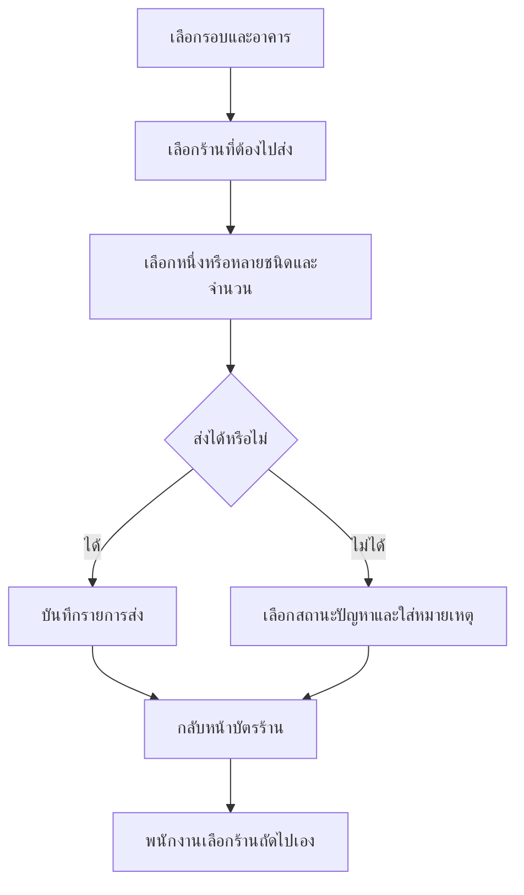

# Wireframe มือถือ

ผังนี้ตั้งใจลดการพิมพ์และไม่เปิดร้านถัดไปอัตโนมัติหลังบันทึก ตามข้อกำหนด MVP. เนื้อหาบนปุ่มเป็นตัวอย่าง ไม่ใช่ข้อมูลร้านจริง.

## 1. หน้าพนักงาน: รายการบัตรร้าน

```text
┌──────────────────────────────┐
│ รอบเช้า · Route A       ออนไลน์ │
│ อาคาร A · 7 / 18 ร้าน          │
├──────────────────────────────┤
│ 010  ร้านเจ๊อ้อย               │
│ ชั้น 1 · ส่งแล้ว · วันนี้ เล็ก 3 │
├──────────────────────────────┤
│ 020  ร้านสุขใจ                 │
│ ชั้น 1 · ยังไม่ส่ง              │
├──────────────────────────────┤
│ 030  ร้านลุงนิด                 │
│ ชั้น 2 · ถังเต็ม                │
└──────────────────────────────┘
```

แตะบัตรร้านเพื่อเปิดรายละเอียด; เรียงตามอาคาร โซน และรหัสร้านเพื่อค้นหาได้ง่าย แต่พนักงานเลือกเองว่าจะไปส่งร้านใด; แสดงสถานะของรอบปัจจุบันและยอดส่งรวมของวันแยกจากกัน.

## 2. หน้าพนักงาน: บันทึกการส่ง

```text
┌──────────────────────────────┐
│ ‹ ร้านสุขใจ          สถานะ: ยังไม่ส่ง │
│ อาคาร A · ชั้น 1                │
├──────────────────────────────┤
│ เลือกน้ำแข็งและจำนวน            │
│ [ก้อน 0] [โม่ 1] [เล็ก 2]       │
│ กำลังแก้: เล็ก                   │
│ [0] [1] [2] [3] [4] [5] [ + ]  │
│                                  │
│ สถานะ [ส่งแล้ว ▾]               │
│ หมายเหตุ (บังคับเมื่อไม่ได้ส่ง) │
│                                  │
│         [ยืนยันบันทึก]           │
├──────────────────────────────┤
│ วันนี้: 04:45 รอบเช้า · เล็ก 1  │
└──────────────────────────────┘
```

ปุ่มยืนยันถูกปิดระหว่างกำลังส่ง. ถ้าออฟไลน์ ให้เปลี่ยนข้อความสำเร็จเป็น “บันทึกเข้าคิวแล้ว” พร้อมจำนวนคิวที่รอซิงก์.

## 3. หน้าหัวหน้ารอบ: ควบคุมรอบ

```text
┌──────────────────────────────┐
│ รอบเช้า · Route A             │
│ เปิด 04:00 · พนักงาน 3 คน      │
├──────────────────────────────┤
│ ทั้งหมด 18  ส่งแล้ว 12  ค้าง 4 │
│ ปัญหา 2                        │
├──────────────────────────────┤
│ สรุปน้ำแข็ง          ควรส่ง/ส่งจริง │
│ ก้อน                 20 / 20   │
│ โม่                   12 / 11   │
│ เล็ก                  35 / 35   │
│                         ต่าง 1  │
├──────────────────────────────┤
│ [ดูร้านค้าง] [บันทึกยอดรถ]     │
│              [ปิดรอบ]           │
└──────────────────────────────┘
```

หน้าหัวหน้าจะใช้ใน Phase 3; Phase 0 ใช้เป็นข้อตกลงเรื่องข้อมูลและลำดับการตัดสินใจเท่านั้น.

## ลำดับงานที่ต้องไม่เปลี่ยน


